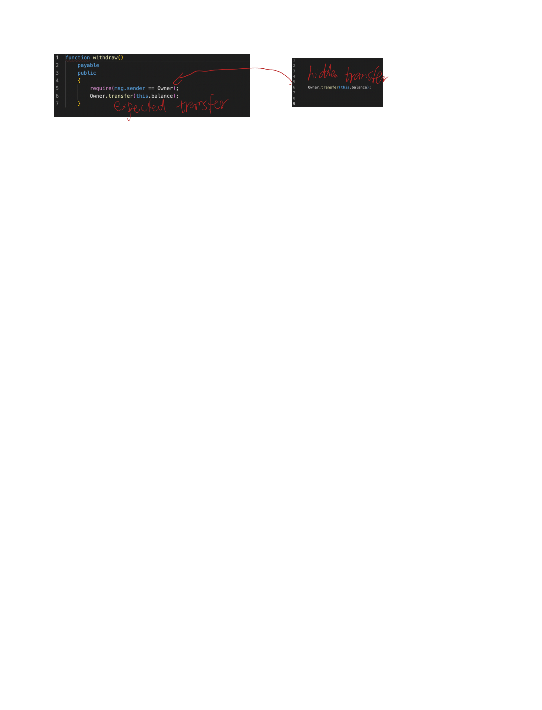

## Vulnerable logic
The attacker hides the first transfer by syntax to 
mislead end user to believe that 
the contract is used to withdraw balance(second transfer).

The first transfer is in line 6, which is hidden by using much space. 
Cautious users can easily ignore this, and the contract transfers 
the total balance of the contract to a **third-party** address.

## Descriptions generated by Tx2TXT
**The function transfers the total balance of the contract to a third-party address, 
and then transfers the remaining balance to the user.r**

## Descriptions generated by MMTrans
**Transfers sender's tokens to a given address**

## Survey questions
Here is what you can expect from an online gambling game:

You must pay to place a bet in this game. 
If you are the winner, the contract must transfer the jackpot (all of its accumulated balance) to your account.

A specific implementation of a gambling game can be described as this:

"**The function transfers the total balance of the contract to a third-party address, 
and then transfers the remaining balance to the user.**"

Do you think this is a secure and fair game that you will play?

Yes
No
Not sure