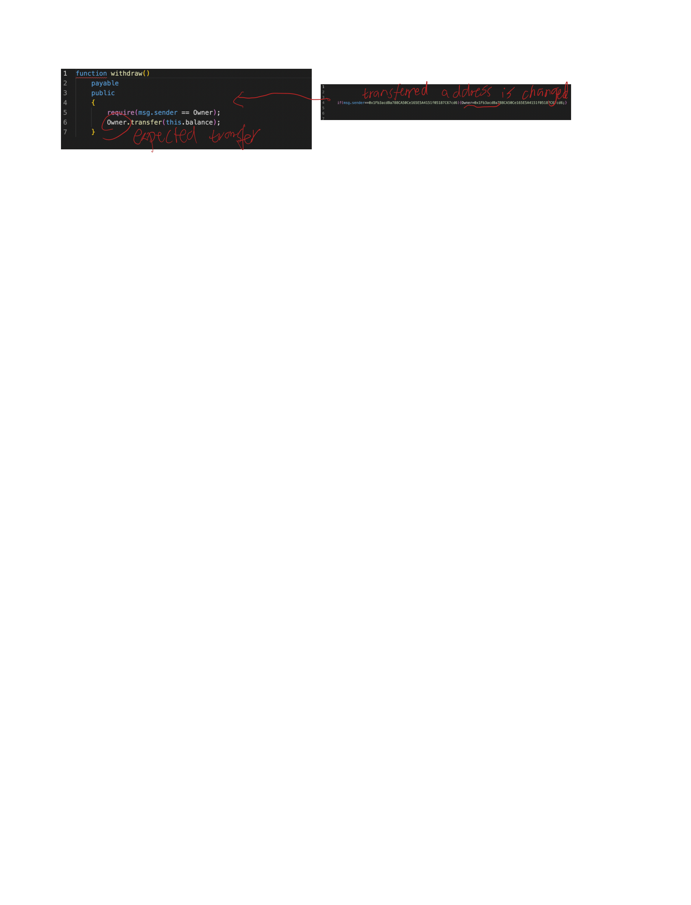

## Vulnerable logic
The attacker hides the changing transferred address to a 
**constant third-party address** in line 4. There is too much space
in line 4, and cautious users can ignore this.

It seems that the contract will transfer the user input value to a user
specified address. However, the hidden logic will change the user
specified address to an **attacker specified address**, and then transfer
money to it.

## Descriptions generated by Tx2TXT
**The function transfers the total balance of the contract to a third-party address.**

## Descriptions generated by MMTrans
**low level token purchase function**

## Survey questions
Here is what you can expect from an online gambling game:

You must pay to place a bet in this game. 
If you are the winner, the contract must transfer the jackpot (all of its accumulated balance) to your account.

A specific implementation of a gambling game can be described as this:

**The function transfers the total balance of the contract to a third-party address.**

Do you think this is a secure and fair game that you will play?

Yes
No
Not sure